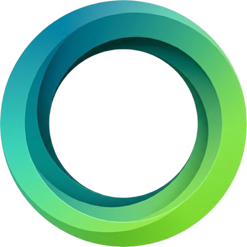

<div align="center">



# OpenScreen Studio

An open-source [Screen Studio](https://screen.studio) clone for macOS, built with Tauri 2 + React 19 + TypeScript.

</div>

Real, in-process screen capture via **ScreenCaptureKit** with a polished editor: auto-zoom-on-click, cursor overlay, wallpaper backgrounds, and project save/open. macOS only.

## Install

Download the latest `.dmg` from [Releases](https://github.com/Glyph-Software/OpenScreenStudio/releases), open it, and drag the app to Applications.

> [!IMPORTANT]
> Release builds are **not notarized by Apple** (this is a free open-source project without a paid Apple Developer account), so on first launch macOS will say the app "cannot be opened because Apple cannot check it for malicious software."
> To open it:
> - **Right-click** (or Control-click) the app → **Open** → **Open** again in the dialog, **or**
> - after the first blocked attempt, go to **System Settings → Privacy & Security** and click **Open Anyway**.

You only need to do this once; afterwards it launches normally.

### Installing on another Mac (permissions won't stick?)

If you grant **Screen Recording** / **Accessibility** but the app keeps showing the onboarding screen and never recognizes the grant, it's a macOS code-signing quirk, not a bug:

1. Move the app **into `/Applications`** via Finder — don't run it straight from the `.dmg` or Downloads. Doing so triggers Gatekeeper "App Translocation", which launches the app from a random read-only path, so the permission grant never matches the next launch.
2. Remove the quarantine flag:
   ```sh
   xattr -dr com.apple.quarantine "/Applications/OpenScreen Studio.app"
   ```
3. Launch from `/Applications`, then grant both permissions. If it still won't recognize them, reset the entries once and re-grant:
   ```sh
   tccutil reset ScreenCapture org.glyphsoftware.oss
   tccutil reset Accessibility  org.glyphsoftware.oss
   ```

Builds produced with `bun run build:signed` (see [Build](#build)) carry a **stable self-signed identity**, which is what lets TCC pin the grant — without it (plain ad-hoc builds) permissions can fail to persist even after steps 1–2.

## Run

```sh
bun install            # installs JS deps; postinstall fetches bundled ffmpeg binaries
bun run tauri dev      # run the desktop app (frontend + Rust)
```

> [!WARNING]
> The screen recording does not work while running in `dev` mode.

> This project uses **Bun**. Never use `npm`/`npx`/`pnpm`/`yarn` — use `bunx <bin>` and `bun run <script>`.

On first launch, if Screen Recording or Accessibility permissions are missing, an onboarding window appears. Grant both in System Settings → Privacy & Security (Accessibility is needed for cursor/click tracking). Otherwise the Capture HUD opens — pick a display / window / area, then record. Recording finishes into the editor.

## Build

```sh
bun run tauri build    # produces .app + .dmg in src-tauri/target/release/bundle/ (ad-hoc signed)
bun run build:signed   # same, but signed with a stable self-signed identity (recommended for release)
bun run build          # frontend-only build (tsc && vite build)
bunx tsc --noEmit      # type-check
```

For Rust: `cd src-tauri && cargo check` / `cargo clippy`.

The bundle ships `entitlements.plist` (camera / audio-input / screen-capture) and usage strings in `Info.plist`. Requires macOS 13+ (the ScreenCaptureKit recording path needs macOS 15+).

### Code signing (no Apple Developer account)

Without a paid Apple account we can't *notarize*, but we can still produce a **stable code signature** — which is what macOS TCC needs so Screen Recording / Accessibility grants persist across launches on other Macs (a plain ad-hoc `tauri build` has no stable Designated Requirement and the grants can fail to stick).

`bun run build:signed` runs [`scripts/sign-cert.sh`](scripts/sign-cert.sh) (idempotent — creates a self-signed `"OpenScreen Studio Self-Signed"` code-signing identity in your login keychain on first run), then builds with `APPLE_SIGNING_IDENTITY` set so Tauri signs the `.app` and the bundled `ffmpeg`. The first build may prompt once for keychain access — click **Always Allow**.

This does **not** remove the Gatekeeper "unidentified developer" warning for end users (that still requires Apple notarization / a $99 Developer account, or a nonprofit/edu fee waiver). It only fixes permission persistence.

#### Released builds (CI signing)

The `.dmg`s on [Releases](https://github.com/Glyph-Software/OpenScreenStudio/releases) are built by [`.github/workflows/release.yml`](.github/workflows/release.yml) on a `v*` tag push. It signs via `tauri-action` when these repo **secrets** are present (otherwise it degrades to an ad-hoc build with green CI):

| Secret | Value |
| --- | --- |
| `APPLE_CERTIFICATE` | base64 of a legacy-format `.p12` holding the self-signed code-signing identity |
| `APPLE_CERTIFICATE_PASSWORD` | the `.p12` export password |
| `APPLE_SIGNING_IDENTITY` | `OpenScreen Studio Self-Signed` (must match the cert CN) |

All CI releases share this one stored identity, so the Designated Requirement is stable across versions and TCC grants persist for end users. To rotate/recreate it, generate a fresh self-signed cert as a **legacy** `.p12` (macOS's `security import` can't read OpenSSL 3's default format):

```sh
openssl req -x509 -newkey rsa:2048 -nodes -days 3650 \
  -keyout key.pem -out cert.pem -subj "/CN=OpenScreen Studio Self-Signed" \
  -addext "keyUsage=critical,digitalSignature" \
  -addext "extendedKeyUsage=critical,codeSigning"
openssl pkcs12 -export -legacy -inkey key.pem -in cert.pem -out ci.p12 -passout pass:PASSWORD
base64 -i ci.p12 | gh secret set APPLE_CERTIFICATE
printf 'PASSWORD' | gh secret set APPLE_CERTIFICATE_PASSWORD
printf 'OpenScreen Studio Self-Signed' | gh secret set APPLE_SIGNING_IDENTITY
```

> Rotating the cert changes the Designated Requirement, so existing users must re-grant Screen Recording / Accessibility once after upgrading to the first build signed by the new cert.

## How capture works

- **Screen recording: ScreenCaptureKit**, entirely in-process via the `screencapturekit` crate. An `SCStream` + `SCRecordingOutput` writes mp4 directly — no ffmpeg sidecar in the recording path. Supports display, window, and cropped-area capture, plus pause / resume / restart / cancel.
- **Audio source enumeration** parses `ffmpeg -f avfoundation -list_devices`; capture itself uses ScreenCaptureKit's built-in microphone path.
- **Cursor sidecar.** During recording a `CursorTrack` records cursor position, clicks, and cursor-shape transitions, then writes a `<recording>.cursor.json` next to the mp4. The editor consumes this for auto-zoom-on-click and the cursor overlay.
- **Mic metering:** `cpal` samples the default input and emits peak amplitude as `mic-level` events at ~30 Hz.

Recordings land in `~/Movies/OpenScreen Studio/OpenScreen-<timestamp>-<uuid>.mp4` (+ matching `.cursor.json`).

**ffmpeg is bundled, not a `$PATH` dependency.** `scripts/fetch-ffmpeg.sh` runs on `postinstall` and downloads `src-tauri/binaries/ffmpeg-{aarch64,x86_64}-apple-darwin`, used only for audio-device enumeration.

## Layout

There is **no single React state machine** — `App.tsx` routes purely by the native window label:

- **permissions** — onboarding for screen-recording + accessibility grants.
- **hud** — small frameless always-on-top bar (`idle | countdown | recording`).
- **editor** (1440×900) — the full editor; hidden until a recording finishes.
- **picker-\*** — transparent per-display overlays for picking a display / window / drag-area.

```
src/
  App.tsx                  routes by window label: editor | permissions | picker-* | hud
  components/
    CaptureHUD.tsx         pre-record HUD (source, webcam/mic/system pills, record btn)
    Permissions.tsx        onboarding grant flow
    PickerOverlay.tsx      per-display overlay: pick display / window / drag an area
    Editor/index.tsx       full editor (~3200 lines): viewport, inspector, timeline,
                           auto-zoom, cursor overlay, save/open
  hooks/                   useAccent, useTheme
  lib/
    native.ts              typed Tauri command wrappers + listen helpers + sidecar types
    autoZoom.ts            derive zoom segments from cursor-sidecar clicks
  styles/                  globals.css + tokens.css (design system, ported from handoff)

src-tauri/
  src/lib.rs               ~2500 lines: SCK capture, picker, cursor sidecar, ~37 #[command]s
  src/main.rs              thin entry; handles --probe-screen-recording subprocess
  tauri.conf.json          window config + asset-protocol scope + externalBin ffmpeg
  Info.plist               camera / microphone / screen-capture usage strings
  entitlements.plist       camera / audio-input / screen-capture

scripts/fetch-ffmpeg.sh    downloads the platform ffmpeg binaries (run on postinstall)
```

See [AGENTS.md](./AGENTS.md) for deeper architecture notes.

## Roadmap

- Webcam capture and compositing.
- System-audio capture.
- Real export pipeline (the Export button currently `alert()`s).
- Richer timeline editing and effects.

## Contributing

Contributions are welcome — bug reports, docs, UI polish, and features. See **[CONTRIBUTION.md](./CONTRIBUTION.md)** for prerequisites, setup, conventions, and the pull-request checklist. For deeper architecture notes, see [AGENTS.md](./AGENTS.md).

## About

Built and maintained by **[Glyph Software LLP](https://glyphsoftware.org)** — _Crafting Scalable Solutions for Modern Needs_. We build AI-powered and custom software: web/mobile, cloud infrastructure, data analytics, and generative AI systems, for startups and enterprises. Based in Bengaluru, India.

- Website: [glyphsoftware.org](https://glyphsoftware.org)
- Email: [contact@glyphsoftware.org](mailto:contact@glyphsoftware.org)
- GitHub: [Glyph-Software](https://github.com/Glyph-Software)
- LinkedIn: [Glyph Software](https://www.linkedin.com/company/glyph-software)
- Hugging Face: [glyphsoftware](https://huggingface.co/glyphsoftware)
